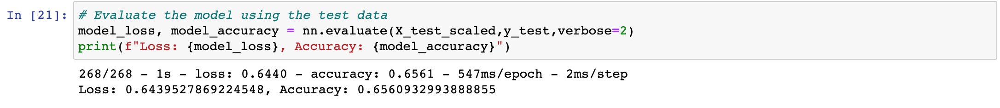

# Neural_Network_Charity_Analysis
create a binary classifier with machine learning and neural networks

## Overview
The purpose of this project is to create a binary classifier that can predict whether 
the application in the charity will be a success. To carry out the project will use machine 
learning and neural networking. To reach the closest accuracy of 75%.

## Results 

### Data Processing 

- What variable(s) are considered the target(s) for your model?

**The target is the column 'IS_SUCCESSFUL', that contains the information of the outcome 
of the aplication.**

.

- What variable(s) are considered to be the features for your model?

**The features columns are 'APPLICATION_TYPE', 'AFFILIATION', 'CLASSIFICATION', 'USE_CASE', 
'ORGANIZATION', 'STATUS', 'INCOME_AMT', 'SPECIAL_CONSIDERATIONS', 'ASK_AMT'.**

.

.

.

- What variable(s) are neither targets nor features, and should be removed from the input data?

**The columns that were removed 'EIN','NAME'.**

.

### Compiling, Training, and Evaluating the Model

- How many neurons, layers, and activation functions did you select for your neural network 
- model, and why?

**first layer with 80 neurons and 'relu' as activation function**

**second layer with 30 neurons and 'relu' as activation function**

**output layer with 'sigmoid' as activation function**

.

- Were you able to achieve the target model performance?

**no, the model did not achieve the performance of 75% accuracy.**

.

- What steps did you take to try and increase model performance?

**Added another layer with 10 neurons with 'relu' activation function and changed the 
numbers of epochs.**

.

.

.

## Summary 

There were several attempts to increase the model's accuracy until I decided to restart 
the kernel and ran it with one more layer and reached 70% accuracy. The model will have 
more effective accuracy with supervised machine learning.
